# Closira — System Visuals Gallery

## 📱 Application Flow

The frontend client dashboard is built using a dark mode theme to provide clear visibility into live lead cycles and administrative widgets.

| Dashboard Core Views | Deep-Link Conversation Actions |
| :---: | :---: |
|    **Figure 1.1: Core KPI Metrics Widget View** |    **Figure 1.2: Thread History & Timeline Stepper** |

---

## ⚙️ Backend Pipeline & Swagger Documentation Flow

The following sequences illustrate request parsing, async thread execution logs, validation boundaries, and persistent data layers.

### Phase 1: Request Ingestion & Data Routing

| 01. Inbound Ingestion Pipeline | 02. Async Queue Return (HTTP 201) |
| :---: | :---: |
| 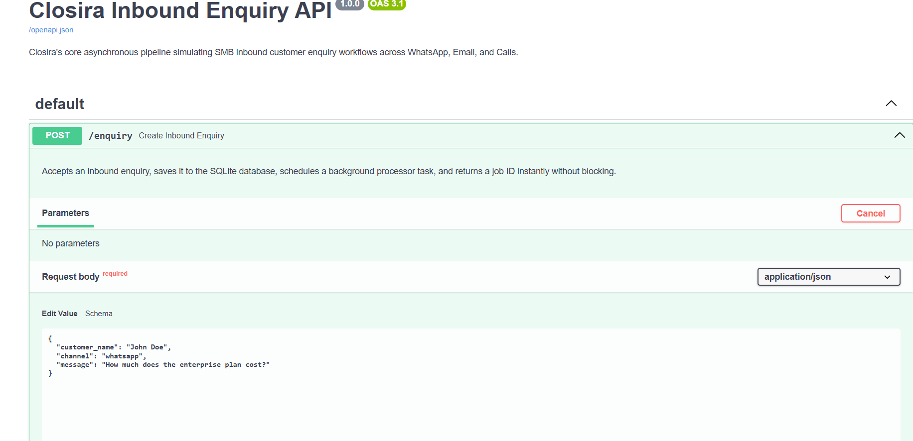   **Route Params Configuration** | 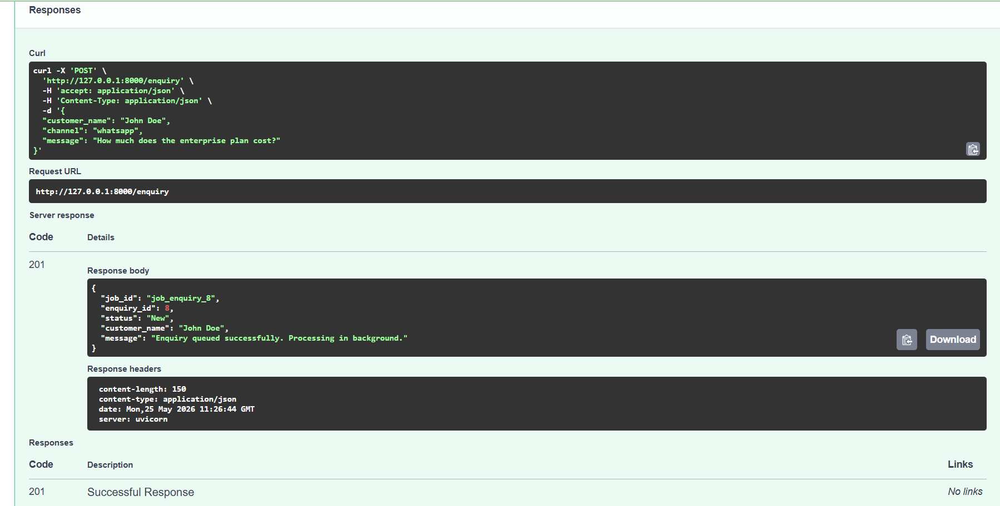   **Job ID Ingestion Return** |

| 03. Validation Error Schema (HTTP 422) | 04. Follow-Up Task Registration |
| :---: | :---: |
| 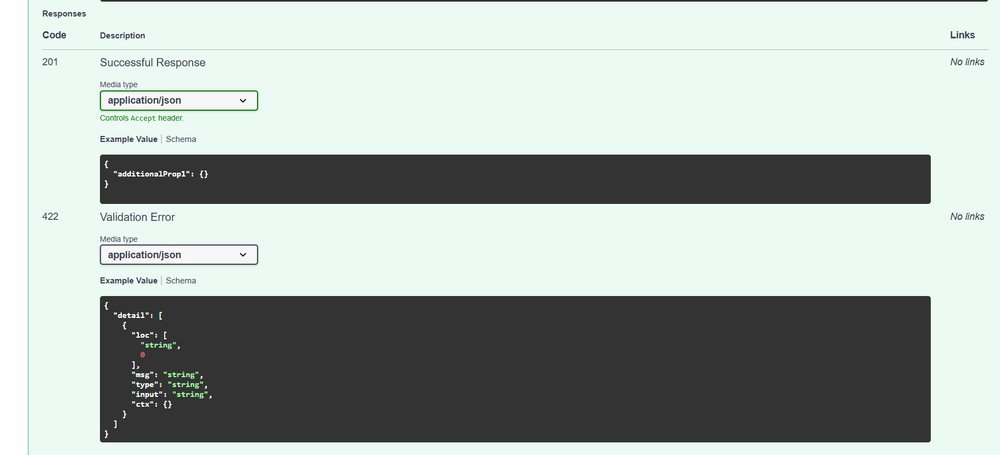   **Pydantic Middleware Catch** | 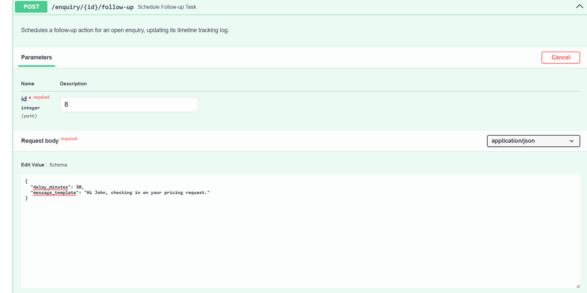   **Delay & Template Payload Setup** |

---

### Phase 2: Action Executions & System Escalations

| 05. Thread Follow-Up Confirmation | 06. Manual Intervention Target Route |
| :---: | :---: |
| 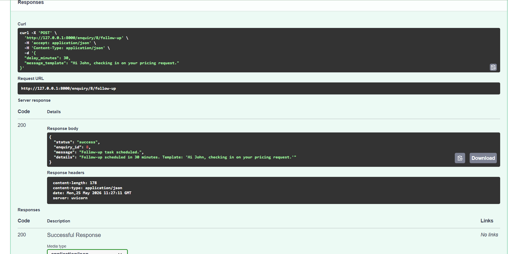   **Task Registered in Event Loop** | 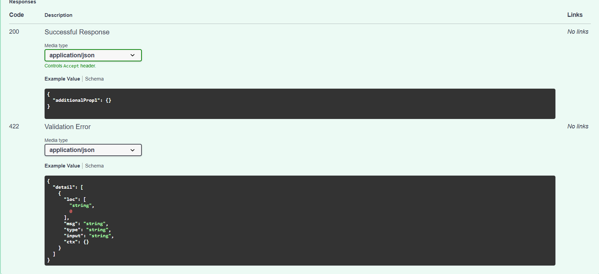   **Escalation Path Validation** |

| 07. Reason-Code Core Submission | 08. Mutation Lifecycle Success |
| :---: | :---: |
| 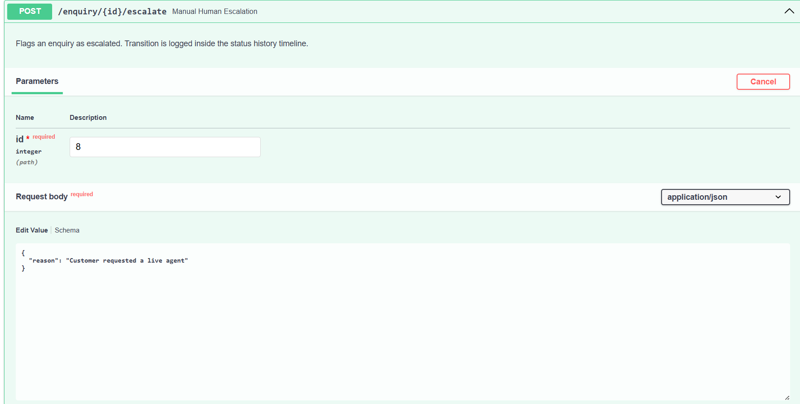   **Override Argument Parsing** | 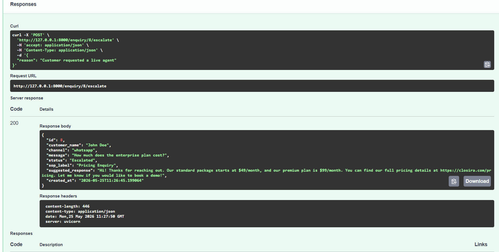   **State Flipped to 'Escalated'** |

---

### Phase 3: Integrity Validation & Testing Records

| 09. DB Persistent Layer Fields | 10. Sequential Activity Audits (GET) |
| :---: | :---: |
| 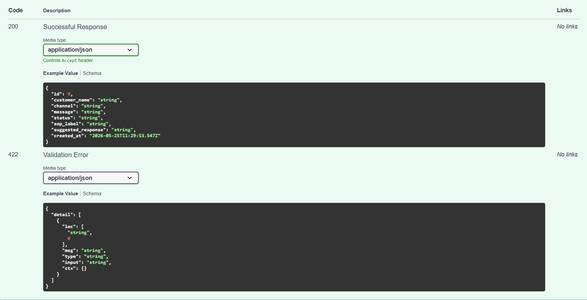   **SQLAlchemy Model Constraints** | 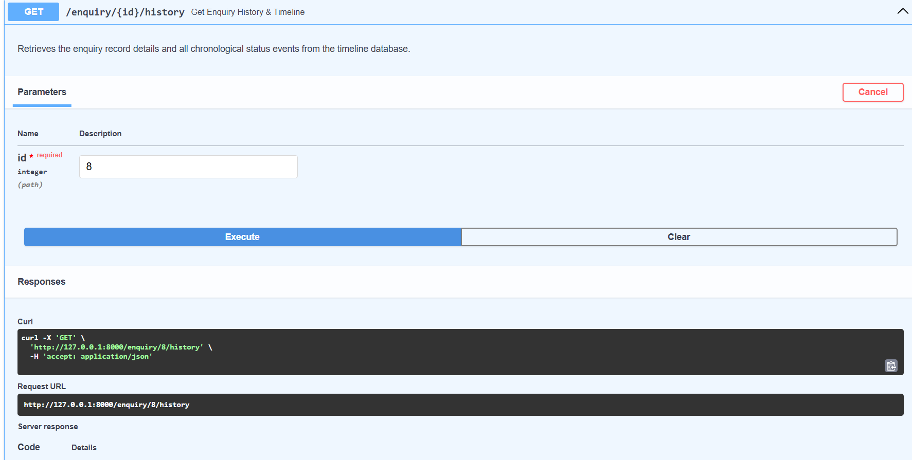   **Historical Timeline History** |

| 11. Endpoint Integration Test Trace | 12. Active Database Health Probes |
| :---: | :---: |
| 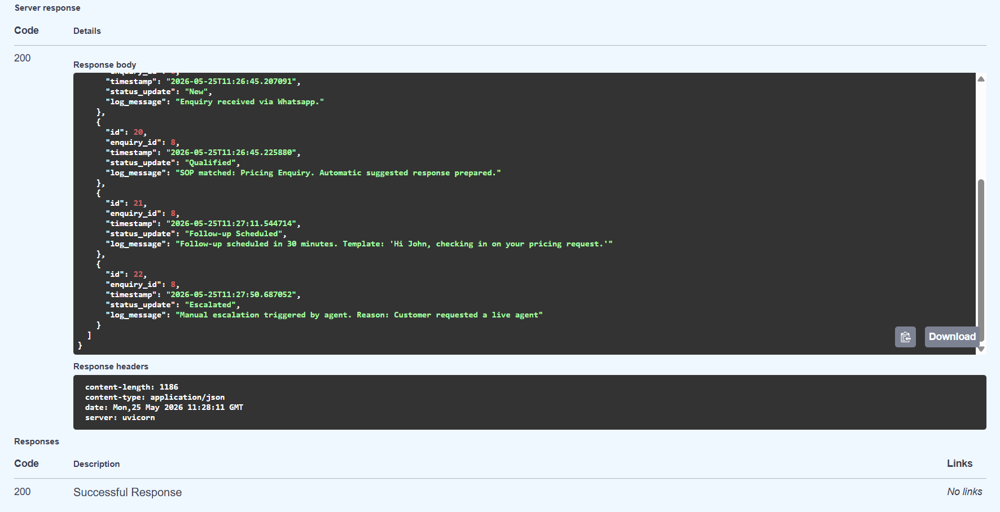   **Integration Verification Run** | 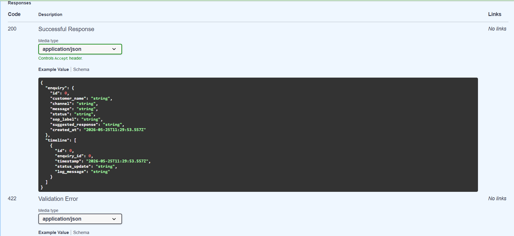   **Storage Connection Active** |

| 13. System Layout Compliance | 14. Data Environment Clean Reset |
| :---: | :---: |
| 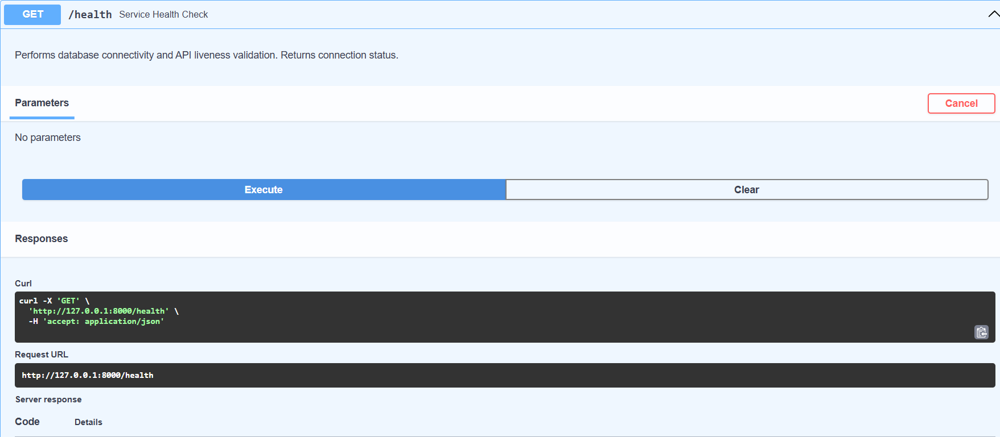   **Pydantic Contract Matches** | 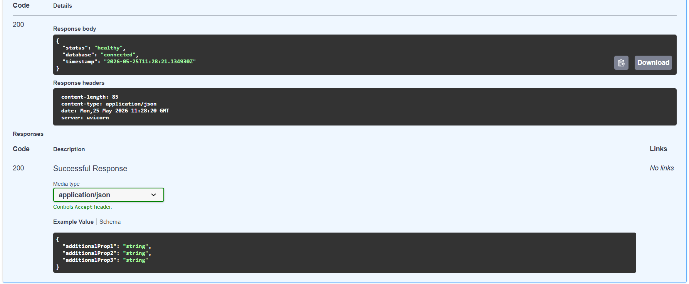   **Clean Workspace Wipe** |
